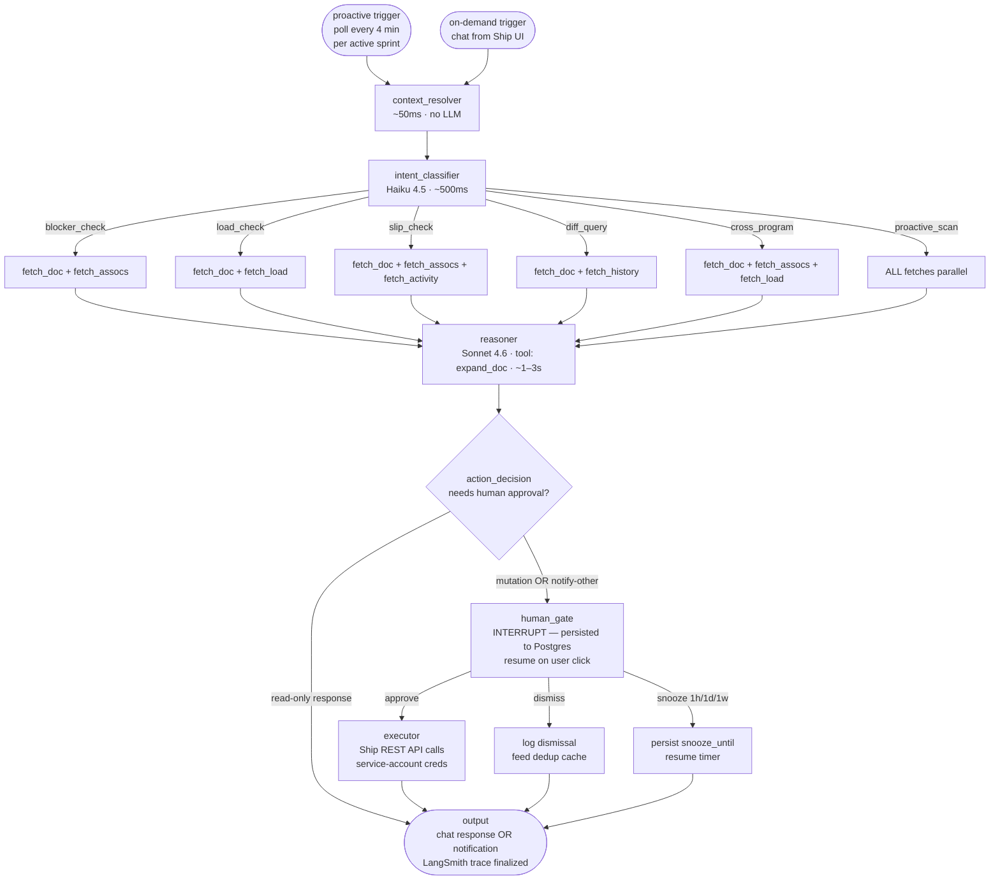

# FleetGraph

A project intelligence agent for Ship. Reads the document graph, reasons about it, and either answers questions scoped to what a user is looking at (on-demand) or surfaces conditions worth acting on without being asked (proactive). Same graph, two triggers.

**Author:** Tyler Xia
**Sprint:** 2026-05-25 → 2026-05-31
**Status:** Architecture Defense draft — MVP-required sections complete; Test Cases / Architecture Decisions / Cost Analysis filled in at their respective deadlines.

---

## Agent Responsibility

FleetGraph is responsible for **graph-traversal reasoning over Ship's unified document model** — answering questions and surfacing conditions that require visiting 2 or more documents and the associations between them. Single-document questions ("what's this issue's state?") are explicitly out of scope; the Ship UI already shows that. The agent's value is in the joins, the deltas, and the implicit "should I be doing something about this?" questions a project lead would ask if they had infinite attention.

### What it monitors proactively

For each `documents WHERE document_type='sprint' AND status='active'` (computed status, not stored), once every 4 minutes:

- **Blocker chains** — issues in `state='blocked'` whose `document_associations` lead to other blocked or stale issues, forming a graph with no in-progress nodes
- **Capacity overruns** — sum of `properties.estimate_hours` on issues assigned this week exceeds a person's `properties.capacity_hours` by ≥20%
- **Slip risk** — sprint with `>40%` of issues in `in_progress` at `>60%` of the time window elapsed (heuristic; tunable)
- **Stale assignments** — issue `state='in_progress'` with no `updated_at` change for 72+ hours
- **Orphaned ownership** — sprint `properties.owner_id` references a person document whose linked user has no activity in 7+ days (PTO heuristic)
- **Retro gap** — sprint window closed but no `weekly_retro` child document exists 48 hours later

These are the seed conditions. The agent's reasoner can also surface conditions the engineer didn't pre-code, with lower confidence (logged but not auto-notified).

### What it reasons about on demand

When a user invokes the chat from within Ship's UI, the agent receives the **scope of the current view** as context: which document the user is looking at, which mode (Programs / Weeks / Resource / Docs), and the user's question. Reasoning ranges from:

- "Is this issue blocking anything else?" (traverses outgoing associations + walks 2 hops)
- "What's slipping this week?" (reads sprint's child issues, compares state distribution to time elapsed)
- "Who else is working on auth?" (semantic search across documents + association traversal)
- "Should I take this issue on?" (compares my current load + this issue's complexity + my historical velocity)
- "What changed in this program since last week's retro?" (diffs sprint snapshots)

The on-demand mode does NOT have to be a question. A user invoking with no message gets a **summary**: "here's the most important thing I'd flag about this scope right now," running the same proactive-detection logic but scoped to one document.

### What it can do autonomously

- **Read** any document the requesting user can read (or any document, for proactive runs using the service account's workspace-wide read scope)
- **Respond** to the requesting user with chat answers, citations, and recommended actions
- **Surface a notification** to the requesting user's own notification rail
- **Log findings** to LangSmith traces + an internal `fleetgraph_findings` table for analytics
- **Suppress** repeated findings via the dedup cache (no user-visible side effect)

### What it must always ask a human about

- **Mutating any Ship document** — state changes, assignments, comments, descope, reassignment
- **Notifying users other than the requester** — including the issue's owner, the sprint owner, or anyone in `document_associations`
- **Triggering external side effects** — posting to Slack/email (future), creating calendar events (future)
- **Modifying its own behavior** — e.g., subscribing/unsubscribing from a detection rule on behalf of the user

The gate UI lives in Ship's existing notification rail: a card showing the agent's reasoning, citations, and the proposed action, with **Approve / Dismiss / Snooze (1h / 1d / 1w)** controls.

### Who it notifies and under what conditions

| Recipient | Conditions | Gate? |
|---|---|---|
| Requester (on-demand) | Always, in response to their question | No |
| Requester (proactive subscription) | A proactive finding for a scope the user has opted into following | No |
| Issue/sprint owner (other than requester) | Proactive finding the agent's reasoner judges relevant to the owner | Yes |
| Workspace admins | Compliance-class findings — orphaned-ownership, retro-gap, persistent slip across 2+ sprints | Yes, batched daily |

### How it knows who is on a project, and what their role is

Ship's separation between **authorization** (`workspace_memberships`) and **content** (`documents WHERE document_type='person'`) — documented in [docs/unified-document-model.md](docs/unified-document-model.md#authorization-vs-content-separation) — is the right read here.

- **Membership** comes from `workspace_memberships` (who's in the workspace + role: admin/member). This is the auth check the agent uses when proxying access.
- **Project assignment** comes from `document_associations` — issues' `parent` and `project` associations, person documents' `properties.user_id` linking to `users.id`.
- **Sprint accountability** comes from `properties.owner_id` on the sprint document.

The agent uses the service-account read scope to enumerate all relevant relationships in a single fetch step; no user-permission proxying for proactive runs (it has read-everything). For on-demand runs, the user's session is enforced — the agent can only respond about documents the user could otherwise see.

### How on-demand mode uses context from the current view

The Ship frontend, when the chat panel is opened, sends `{ scopeType, scopeId, workspaceId, viewMode }` to the agent service alongside any user message. The `context_resolver` node uses this to:

1. Bound the initial fetch — `fetch_doc` reads exactly `scopeId`, not the whole workspace
2. Bias the intent classifier — "what's slipping" on a sprint scope is interpreted differently than the same question on an issue scope
3. Constrain the citations — answers cite documents in or adjacent to the current scope, not random workspace documents

If the user navigates away mid-conversation, the conversation thread retains the **original** scope it was opened in; switching scopes opens a new chat thread. This prevents the "I keep talking about issue X but the user is now looking at sprint Y" failure mode.

---

## Graph Diagram

Both proactive and on-demand modes traverse the same graph. Only the entry node and initial state differ.

**Node responsibilities at a glance:**

| Node | Purpose | Model | Latency | Notes |
|---|---|---|---|---|
| `context_resolver` | Normalize trigger + scope into state object | — | ~50ms | Deterministic |
| `intent_classifier` | Map question/state to one of 6 intents + required fetches | Haiku 4.5 | ~500ms | First conditional edge fans out from here |
| `fetch_doc` | Load primary doc(s) for scope | — | ~100ms | Ship API or direct pg |
| `fetch_assocs` | Load incoming + outgoing `document_associations`, 2-hop max | — | ~150ms | Capped at 50 edges/hop |
| `fetch_load` | For person/sprint scopes — assigned issues + capacity | — | ~150ms | Aggregates `estimate_hours` |
| `fetch_activity` | Recent state changes + comments within N days | — | ~100ms | Defaults to 7 days |
| `fetch_history` | Previous sprint/week snapshot for diff queries | — | ~200ms | Reads `fleetgraph_snapshots` |
| `reasoner` | Synthesize fetched data into structured finding | Sonnet 4.6 | ~1–3s | Has `expand_doc(id)` tool for follow-up traversal |
| `action_decision` | Classify reasoning output as read-only or mutating; conditional edge | — | ~10ms | Deterministic; second conditional edge |
| `human_gate` | INTERRUPT — pause graph, persist checkpoint, post proposal | — | indefinite | Third conditional edge (approve/dismiss/snooze) |
| `executor` | Make Ship API calls for approved mutations | — | ~200ms | Records audit trail |
| `output` | Format chat response or notification; finalize trace | — | ~50ms | Terminal node |

**Parallelism:** the 4 fetch nodes can run concurrently within the same intent branch; `proactive_scan` always runs all 4 in parallel for full breadth.

**State persistence:** LangGraph's `PostgresSaver` checkpoints state at every node boundary, indexed by `thread_id` (scope_id for proactive, conversation_id for on-demand). Used for:
- Resuming from `human_gate` interrupts after hours or days
- Dedup cache (`finding_hash → last_surfaced_at`)
- Cross-run learning (dismiss patterns → suppression heuristics)

---

## Use Cases

Six concrete use cases. The agent ships with detectors for all six, plus the reasoner's open-ended judgment for conditions outside this list (logged at lower confidence).

| # | Role | Trigger | Agent detects / produces | Human decides |
|---|---|---|---|---|
| 1 | Engineer | On-demand: opens chat on an issue, asks "is this blocking anything?" | Traverses outgoing `document_associations` (children + linked issues), filters to `state != 'done'`, walks 2 hops. Returns ranked list: "AUTH-42 blocks AUTH-43 (in_progress, Shawn, no update 4d), AUTH-44 (todo, unassigned), AUTH-49 (blocked, stale 7d)." Cites each blocked doc. | Whether to escalate, unblock, or de-scope. Agent will draft an escalation comment on request — gated. |
| 2 | PM | On-demand: opens chat on a sprint, asks "what's slipping?" | Reads sprint's child issues, computes (in_progress count) vs. (days remaining × team velocity), flags issues with no `updated_at` in 48h+, surfaces tail risk: "5 issues remain in_progress with 2 days left at current pace; PAY-12 and PAY-19 haven't changed state since Monday." | Which slips to triage, which to accept, which to escalate to the program owner. |
| 3 | Director | On-demand: in Resource mode, asks "who's overloaded this week?" | Pulls all `person` documents in workspace, joins to their assigned issues this week via `document_associations`, sums `properties.estimate_hours`, compares to each person's `properties.capacity_hours`. Returns ranked list: "Shawn at 132% (52h assigned vs 40h capacity), Maria at 118%, Jordan at 95%." | Whether to rebalance, hire, de-scope, or accept. Agent will propose specific reassignment moves — gated. |
| 4 | PM | **Proactive**: every 4 min per active sprint | Detects **blocker chain** — issue A `state=blocked` linked to B `state=blocked` linked to C, all with `updated_at` older than 48h. Posts a notification card to the sprint owner proposing escalation to the program owner. | Approve (agent drafts and posts escalation comment), Dismiss (silences for exponential backoff), Snooze. |
| 5 | Engineer | On-demand: on a program page, asks "what changed since last week's retro?" | Diffs current sprint's issue list vs. the previous sprint's snapshot: added scope, removed scope, state regressions (`in_progress → backlog`), assignee changes. Returns structured diff with counts and 3-5 most-significant items called out. | Whether to update the retro doc with the diff. Agent will write the diff into the retro doc — gated. |
| 6 | PM | **Proactive**: triggered on sprint creation event (detected by next poll cycle) | Reads new sprint's planned issues, sums `estimate_hours` vs. team capacity for that week. If sum >80% of capacity, identifies the lowest-priority issues that fit the overage and proposes de-scope: "AUTH-101 (low priority, 8h) and AUTH-105 (low, 6h) would bring the sprint to 78% capacity." | Whether to actually de-scope. Agent makes the moves on approval — gated. |

**Pattern across all six:** every use case requires reasoning over 2+ document types AND 2+ associations. Single-document UI views can't produce these answers without manual clicking. That's the agent's value moat.

**On the open-ended reasoner:** in addition to these six pre-coded detectors, the reasoner has freedom to surface novel conditions during `proactive_scan`. These are logged at `confidence='low'` and only surfaced to users who opt into "experimental detections" — they're not blocked from happening, just gated behind explicit opt-in to avoid noise.

---

## Trigger Model

**Decision: hybrid — poll for proactive, in-band synchronous for on-demand. Webhooks deferred to v2.**

### Poll cadence and rationale

- **Per active sprint, every 4 minutes.** A `setInterval(60_000)` in the agent service queries `documents WHERE document_type='sprint'` filtered to active sprints (computed from `properties.sprint_number` + workspace start date, per Ship's week model). For each, checks `last_run_at` in the `fleetgraph_runs` table; runs again if ≥4 min elapsed.
- **4 min, not 5**, to give 1 minute of margin against the 5-min SLA in the PRD. Graph run time itself is ~2–5s, so total worst-case event-to-surface is ~4:05.
- **Per active sprint, not per workspace**, because Ship's data model groups work by sprint and most detections are sprint-scoped. Running once per workspace would force the graph to enumerate sprints itself; lifting that to the trigger layer keeps graph runs focused and traces clean.

### Why poll, not webhook (yet)

| Factor | Poll (chosen) | Webhook (deferred) |
|---|---|---|
| Ship support | Already works — Ship exposes the documents API the poller reads | Doesn't exist — Ship would need an event-bus subsystem, retry semantics, signature verification, dead-letter queue, delivery guarantees |
| Cost predictability | Linear and known: N sprints × 360 polls/day | Variable based on event volume; bursty during sprint-end pushes |
| Detection latency floor | 4 min (poll cadence) | Sub-second possible |
| Detection latency ceiling | 4 min + graph time (~4:05) | Depends on delivery + retry semantics |
| Implementation cost | Hours | Days (Ship-side changes) |
| Failure mode | Misses if poll fails — re-tried next cycle, max 8-min gap | Misses if webhook delivery fails — needs dead-letter + retry |

The 5-min PRD SLA is achievable with polling, so webhooks are an optimization, not a requirement.

### Webhook migration path (documented for completeness)

When event volume justifies the move:

1. Add `documents` table triggers in Postgres emitting to a `fleetgraph_events` outbox table
2. Add an outbox-poller in the agent service that drains `fleetgraph_events` every 5s and fires per-event graph runs
3. Same graph; just a faster trigger
4. Polling stays on as a fallback to catch missed events (defense in depth)

### On-demand: in-band synchronous

User chat in the Ship UI → Ship API forwards to agent service `POST /agent/chat` → graph runs synchronously, streams response via SSE. Sub-second perceived latency for the first token; full response in ~2–4s for typical reasoning.

### Cost projection at scale (preview — full breakdown in Cost Analysis section)

| Scale | Active sprints | Proactive runs/day | On-demand runs/day | Combined $/month |
|---|---|---|---|---|
| 100 users (~20 sprints) | 20 | 7,200 | 100 | ~$280/mo |
| 1,000 users (~200 sprints) | 200 | 72,000 | 1,000 | ~$2,800/mo |
| 10,000 users (~2,000 sprints) | 2,000 | 720,000 | 10,000 | ~$28,000/mo |

Linear scaling; reasoner is the dominant cost (~$0.012/run). Cost cliffs documented in the Cost Analysis section at final submission.

### Detection-latency verification plan

Per PRD: "latency will be verified with a timed test run. An event will be introduced into Ship and the clock starts."

Test protocol:
1. Pre-create an active sprint with a healthy state (no blockers)
2. Start a stopwatch
3. Insert a `state='blocked'` issue linked to another `state='blocked'` issue, both with `updated_at` 49 hours ago (fabricated)
4. Wait for the agent to surface the blocker-chain finding via notification
5. Stop stopwatch
6. Expected: under 5 minutes; budgeted: under 4:05.

Trace evidence captured in the Test Cases section.

---

## Test Cases

> **Due at Early Submission (Thursday 2026-05-28).** Placeholder maintained so reviewers can see the planned shape.

For each of the 6 use cases in the table above, this section will provide:

| # | Ship State | Expected Output | Trace Link |
|---|---|---|---|
| 1 | An issue with 3 child issues, 2 in `state='blocked'` with no updates in 4 days | Chat response listing the 2 blocked dependents with ages and owners; cites both issue documents | TBD — LangSmith URL after first run |
| 2 | A sprint at 60% of its time window with 5 of 8 issues in `in_progress` | Chat response naming the 5 in-progress issues, flagging the 2 with no `updated_at` change | TBD |
| 3 | A workspace with 4 people, 1 over capacity (40h assigned vs 30h capacity) | Resource-mode chat response ranking the overload; structured proposal for rebalancing | TBD |
| 4 | A sprint with a 3-deep blocker chain, all blocked >48h | Proactive notification to sprint owner with escalation proposal; HITL gate active | TBD |
| 5 | A program with two sprints; current sprint has 3 issues added, 1 dropped, 2 state regressions vs previous | Diff response with 3+1+2 counts and the regression docs called out | TBD |
| 6 | A newly-created sprint with planned issues summing to 115% of capacity | Proactive notification with 2 specific de-scope candidates | TBD |

**Latency test case 7:** an event introduced after a known-quiet poll cycle; verify surface within 5 min. LangSmith trace will capture timestamps.

---

## Architecture Decisions

> **Due at Early Submission (Thursday 2026-05-28).** Stub for now; reasoning above is the source material.

Key decisions to be documented in full:

1. **Framework: LangGraph.js, in a new `agent/` workspace** within Ship's existing pnpm monorepo. Rationale: PRD recommends LangGraph (auto LangSmith tracing); JS keeps everything in Ship's TypeScript stack, reuses `shared/` types for the document model, deploys via the same Render pipeline as `api/`, avoids cross-language marshaling.

2. **Node design rationale**: separation of context resolution / intent classification / parallel fetch / reasoning / action / HITL / execution mirrors the agent's logical stages, makes per-stage observability cheap, and lets the LangSmith trace shape directly reveal which intent fired.

3. **State management**: LangGraph's `Annotation.Root` for in-run state, `PostgresSaver` for cross-run checkpoints + HITL pause-resume. Uses Ship's existing Neon DB with a separate `fleetgraph_*` schema (separate migration). Suppression cache keyed by `(scope_id, finding_hash)`.

4. **Deployment model**: new Render web service `ship-agent` alongside `ship-api-76ez`. Service-account API key for Ship API access. Render's built-in cron OR a `setInterval` in the service process for proactive triggers (TBD — `setInterval` is simpler but Render cron survives process restarts cleanly).

5. **Observability**: LangSmith tracing enabled from day one via `langsmith` npm package. Traces tagged with `mode` (`proactive`/`on_demand`), `intent`, `scope_type`, `scope_id`. Distinct execution paths produce visibly different traces per the PRD's "pipeline test."

---

## Cost Analysis

> **Due at Final Submission (Sunday 2026-05-31).** Placeholders below capture the cost model for ongoing validation.

### Development and Testing Costs

| Item | Amount |
|---|---|
| Claude API — input tokens (cumulative) | TBD — measured from Anthropic Console |
| Claude API — output tokens (cumulative) | TBD |
| Total invocations during development | TBD |
| Total development spend | TBD |

Token budget per production graph run (working numbers, refined at final):

| Step | Model | Input tokens | Output tokens | $/run |
|---|---|---|---|---|
| `intent_classifier` | claude-haiku-4-5 | ~200 | ~80 | ~$0.0003 |
| `reasoner` | claude-sonnet-4-6 | ~2,000 | ~400 | ~$0.012 |
| **Total per graph run** | | | | **~$0.013** |

### Production Cost Projections

| 100 Users | 1,000 Users | 10,000 Users |
|---|---|---|
| ~$280/mo | ~$2,800/mo | ~$28,000/mo |

**Assumptions:**

- **Active sprints per 100 users:** ~20 (5 programs × 4 active sprints, typical Treasury-style PM rhythm)
- **Proactive runs per project per day:** 360 (one every 4 min, 24 h)
- **On-demand invocations per user per day:** ~1 average (heavy users 5+, most users 0–1)
- **Average tokens per invocation:** ~2,600 (intent + reasoner combined)
- **Cost per run:** ~$0.013
- **Estimated runs per day at 100 users:** ~7,300 (7,200 proactive + 100 on-demand)

**Cost cliffs to be aware of:**

1. **Reasoner is the spend driver** — 92% of per-run cost. Mitigations: cache fetched data within a graph run; suppress reasoner calls when the finding hash matches a recent dismissal.
2. **`fetch_assocs` unbounded** — a document with hundreds of associations would balloon context. Hard cap at 50 edges per hop, 100 total per run.
3. **Conversation history growth** — chat threads with 20+ turns blow context. Bounded to 10 turns; older turns summarized into a single system message.
4. **Polling × active sprints** — linear cost growth. At 10,000 users we'd want to switch to event-driven (webhooks) to avoid paying for polls that find nothing.

Full breakdown, including actual development spend and tuned per-token figures, lands at Final Submission.

---

## Submission tracker

| Section | Due | Status |
|---|---|---|
| Agent Responsibility | MVP (Tue 11:59 PM) | ✅ Drafted |
| Graph Diagram | MVP | ✅ Drafted |
| Use Cases | MVP | ✅ Drafted (6 use cases) |
| Trigger Model | MVP | ✅ Drafted |
| Test Cases | Early Submission (Thu 11:59 PM) | 🔄 Shape locked; traces fill in after first runs |
| Architecture Decisions | Early Submission | 🔄 Source material drafted above; formal write-up at deadline |
| Cost Analysis | Final Submission (Sun noon) | 🔄 Cost model defined; actuals fill in from Anthropic Console |
