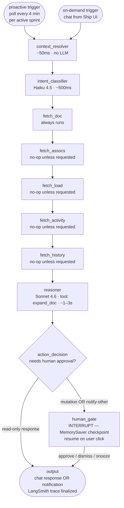

# FleetGraph

A project intelligence agent for Ship. Reads the document graph, reasons about it, and either answers questions scoped to what a user is looking at (on-demand) or surfaces conditions worth acting on without being asked (proactive). Same graph, two triggers.

**Author:** Tyler Xia
**Sprint:** 2026-05-25 → 2026-05-31
**Status:** Architecture Defense draft — MVP-required sections complete; Test Cases / Architecture Decisions / Cost Analysis filled in at their respective deadlines.

---

## Agent Responsibility

FleetGraph is responsible for **graph-traversal reasoning over Ship's unified document model** — answering questions and surfacing conditions that require visiting 2 or more documents and the associations between them. Single-document questions ("what's this issue's state?") are explicitly out of scope; the Ship UI already shows that. The agent's value is in the joins, the deltas, and the implicit "should I be doing something about this?" questions a project lead would ask if they had infinite attention.

### What it monitors proactively

For each `documents WHERE document_type='sprint' AND status='active'` (computed status, not stored), once every 4 minutes:

- **Blocker chains** — issues in `state='blocked'` whose `document_associations` lead to other blocked or stale issues, forming a graph with no in-progress nodes
- **Capacity overruns** — sum of `properties.estimate_hours` on issues assigned this week exceeds a person's `properties.capacity_hours` by ≥20%
- **Slip risk** — sprint with `>40%` of issues in `in_progress` at `>60%` of the time window elapsed (heuristic; tunable)
- **Stale assignments** — issue `state='in_progress'` with no `updated_at` change for 72+ hours
- **Orphaned ownership** — sprint `properties.owner_id` references a person document whose linked user has no activity in 7+ days (PTO heuristic)
- **Retro gap** — sprint window closed but no `weekly_retro` child document exists 48 hours later

These are the seed conditions. The agent's reasoner can also surface conditions the engineer didn't pre-code, with lower confidence (logged but not auto-notified).

### What it reasons about on demand

When a user invokes the chat from within Ship's UI, the agent receives the **scope of the current view** as context: which document the user is looking at, which mode (Programs / Weeks / Resource / Docs), and the user's question. Reasoning ranges from:

- "Is this issue blocking anything else?" (MVP traverses the scoped document's outgoing associations; deeper traversal is a v2 expansion)
- "What's slipping this week?" (reads sprint's child issues, compares state distribution to time elapsed)
- "Who else is working on auth?" (semantic search across documents + association traversal)
- "Should I take this issue on?" (compares my current load + this issue's complexity + my historical velocity)
- "What changed in this program since last week's retro?" (diffs sprint snapshots)

The on-demand mode does NOT have to be a question. A user invoking with no message gets a **summary**: "here's the most important thing I'd flag about this scope right now," running the same proactive-detection logic but scoped to one document.

### What it can do autonomously

- **Read** any document the requesting user can read (or any document, for proactive runs using the service account's workspace-wide read scope)
- **Respond** to the requesting user with chat answers, citations, and recommended actions
- **Surface a notification** to the requesting user's own notification rail
- **Log findings** to LangSmith traces + an internal `fleetgraph_findings` table for analytics
- **Persist proactive findings** to Ship via `/api/fleetgraph/findings`, deduped by `(workspace_id, scope_id, finding_hash)`
- **Suppress** repeated findings via the dedup cache (no user-visible side effect)

### What it must always ask a human about

- **Mutating any Ship document** — state changes, assignments, comments, descope, reassignment
- **Notifying users other than the requester** — including the issue's owner, the sprint owner, or anyone in `document_associations`
- **Triggering external side effects** — posting to Slack/email (future), creating calendar events (future)
- **Modifying its own behavior** — e.g., subscribing/unsubscribing from a detection rule on behalf of the user

The gate UI lives in Ship's existing notification rail: a card showing the agent's reasoning, citations, and the proposed action, with **Approve / Dismiss / Snooze (1h / 1d / 1w)** controls.

### Who it notifies and under what conditions

| Recipient | Conditions | Gate? |
|---|---|---|
| Requester (on-demand) | Always, in response to their question | No |
| Requester (proactive subscription) | A proactive finding for a scope the user has opted into following | No |
| Issue/sprint owner (other than requester) | Proactive finding the agent's reasoner judges relevant to the owner | Yes |
| Workspace admins | Compliance-class findings — orphaned-ownership, retro-gap, persistent slip across 2+ sprints | Yes, batched daily |

### How it knows who is on a project, and what their role is

Ship's separation between **authorization** (`workspace_memberships`) and **content** (`documents WHERE document_type='person'`) — documented in [docs/unified-document-model.md](docs/unified-document-model.md#authorization-vs-content-separation) — is the right read here.

- **Membership** comes from `workspace_memberships` (who's in the workspace + role: admin/member). This is the auth check the agent uses when proxying access.
- **Project assignment** comes from `document_associations` — issues' `parent` and `project` associations, person documents' `properties.user_id` linking to `users.id`.
- **Sprint accountability** comes from `properties.owner_id` on the sprint document.

The agent uses the service-account read scope to enumerate all relevant relationships in a single fetch step; no user-permission proxying for proactive runs (it has read-everything). For on-demand runs, the user's session is enforced — the agent can only respond about documents the user could otherwise see.

### How on-demand mode uses context from the current view

The Ship frontend, when the chat panel is opened, sends `{ scopeType, scopeId, workspaceId, viewMode }` to the agent service alongside any user message. The `context_resolver` node uses this to:

1. Bound the initial fetch — `fetch_doc` reads exactly `scopeId`, not the whole workspace
2. Bias the intent classifier — "what's slipping" on a sprint scope is interpreted differently than the same question on an issue scope
3. Constrain the citations — answers cite documents in or adjacent to the current scope, not random workspace documents

If the user navigates away mid-conversation, the conversation thread retains the **original** scope it was opened in; switching scopes opens a new chat thread. This prevents the "I keep talking about issue X but the user is now looking at sprint Y" failure mode.

---

## Graph Diagram

Both proactive and on-demand modes traverse the same graph. Only the entry node and initial state differ.



**Node responsibilities at a glance:**

| Node | Purpose | Model | Latency | Notes |
|---|---|---|---|---|
| `context_resolver` | Normalize trigger + scope into state object | — | ~50ms | Deterministic |
| `intent_classifier` | Map question/state to one of 6 intents + required fetches | Haiku 4.5 | ~500ms | First conditional edge fans out from here |
| `fetch_doc` | Load primary doc(s) for scope | — | ~100ms | Ship API or direct pg |
| `fetch_assocs` | Load outgoing `document_associations` for the current scope | — | ~150ms | Capped at 50 edges; reverse sprint associations are used by `fetch_load` |
| `fetch_load` | For person/sprint scopes — assigned issues + capacity | — | ~150ms | Aggregates `estimate_hours` via existing Ship APIs |
| `fetch_activity` | Recent change signal | — | ~100ms | Derived from `updated_at` for scope + sprint issues |
| `fetch_history` | Lightweight historical context for diff queries | — | ~100ms | Reads existing property history arrays; full snapshots are v2 |
| `reasoner` | Synthesize fetched data into structured finding | Sonnet 4.6 | ~1–3s | Structured output only in MVP; follow-up traversal tool is v2 |
| `action_decision` | Classify reasoning output as read-only or mutating; conditional edge | — | ~10ms | Deterministic; second conditional edge |
| `human_gate` | INTERRUPT — pause graph and wait for approve/dismiss/snooze | — | indefinite | Resumes to output in MVP; mutation executor is v2 |
| `output` | Format chat response or notification; persist proactive finding; finalize trace | — | ~50ms | Terminal node |

**Fetch strategy:** the MVP graph uses a deterministic fetch chain rather than LangGraph parallel fan-out. Each optional fetch node checks `intent.requiredFetches` and returns immediately when it is not needed. This produces stable traces while still making intent-specific runs materially different: `load_check` includes `fetch_load`, `slip_check` includes `fetch_activity`, `diff_query` includes `fetch_history`, and read-only blocker checks stay small.

**State persistence:** MVP uses LangGraph `MemorySaver` checkpoints indexed by `thread_id` so HITL interrupts can resume within the same running agent process. `PostgresSaver` is the planned hardening path for cross-restart persistence, dedup tables, and long-lived snoozes.

---

## Use Cases

Six concrete use cases. The MVP graph supports all six through scoped fetches plus the reasoner's structured output; deterministic hard-coded detectors are strongest for blocker, load, activity/staleness, and lightweight history signals. Fuller snapshot diffing and durable suppression are v2 hardening items.

| # | Role | Trigger | Agent detects / produces | Human decides |
|---|---|---|---|---|
| 1 | Engineer | On-demand: opens chat on an issue, asks "is this blocking anything?" | Traverses outgoing `document_associations` for the scoped issue, filters to unfinished related docs, and returns a cited blocker summary. Deeper multi-hop traversal is the next hardening step once reverse/typed associations are normalized across all document kinds. | Whether to escalate, unblock, or de-scope. Agent will draft an escalation comment on request — gated. |
| 2 | PM | On-demand: opens chat on a sprint, asks "what's slipping?" | Reads sprint's child issues, computes (in_progress count) vs. (days remaining × team velocity), flags issues with no `updated_at` in 48h+, surfaces tail risk: "5 issues remain in_progress with 2 days left at current pace; PAY-12 and PAY-19 haven't changed state since Monday." | Which slips to triage, which to accept, which to escalate to the program owner. |
| 3 | Director | On-demand: in Resource mode, asks "who's overloaded this week?" | Pulls all `person` documents in workspace, joins to their assigned issues this week via `document_associations`, sums `properties.estimate_hours`, compares to each person's `properties.capacity_hours`. Returns ranked list: "Shawn at 132% (52h assigned vs 40h capacity), Maria at 118%, Jordan at 95%." | Whether to rebalance, hire, de-scope, or accept. Agent will propose specific reassignment moves — gated. |
| 4 | PM | **Proactive**: every 4 min per active sprint | Detects **blocker chain** — issue A `state=blocked` linked to B `state=blocked` linked to C, all with `updated_at` older than 48h. Posts a notification card to the sprint owner proposing escalation to the program owner. | Approve (agent drafts and posts escalation comment), Dismiss (silences for exponential backoff), Snooze. |
| 5 | Engineer | On-demand: on a program/page asks "what changed since last week's retro?" | MVP reads lightweight history already present on the scoped document and recent activity for adjacent docs. Full current-vs-previous sprint snapshot diffing is documented as the v2 path. | Whether to update the retro doc with the diff. Agent will draft the diff — gated before any write. |
| 6 | PM | **Proactive**: triggered on sprint creation event (detected by next poll cycle) | Reads new sprint's planned issues, sums `estimate_hours` vs. team capacity for that week. If sum >80% of capacity, identifies the lowest-priority issues that fit the overage and proposes de-scope: "AUTH-101 (low priority, 8h) and AUTH-105 (low, 6h) would bring the sprint to 78% capacity." | Whether to actually de-scope. Agent makes the moves on approval — gated. |

**Pattern across all six:** every use case requires reasoning over 2+ document types AND 2+ associations. Single-document UI views can't produce these answers without manual clicking. That's the agent's value moat.

**On the open-ended reasoner:** in addition to these six pre-coded detectors, the reasoner has freedom to surface novel conditions during `proactive_scan`. These are logged at `confidence='low'` and only surfaced to users who opt into "experimental detections" — they're not blocked from happening, just gated behind explicit opt-in to avoid noise.

---

## Trigger Model

**Decision: hybrid — poll for proactive, in-band synchronous for on-demand. Webhooks deferred to v2.**

### Poll cadence and rationale

- **Per active sprint, every 4 minutes.** A `setInterval(60_000)` in the agent service queries `documents WHERE document_type='sprint'` filtered to active sprints (computed from `properties.sprint_number` + workspace start date, per Ship's week model). For each, checks `last_run_at` in the `fleetgraph_runs` table; runs again if ≥4 min elapsed.
- **4 min, not 5**, to give 1 minute of margin against the 5-min SLA in the PRD. Graph run time itself is ~2–5s, so total worst-case event-to-surface is ~4:05.
- **Per active sprint, not per workspace**, because Ship's data model groups work by sprint and most detections are sprint-scoped. Running once per workspace would force the graph to enumerate sprints itself; lifting that to the trigger layer keeps graph runs focused and traces clean.

### Why poll, not webhook (yet)

| Factor | Poll (chosen) | Webhook (deferred) |
|---|---|---|
| Ship support | Already works — Ship exposes the documents API the poller reads | Doesn't exist — Ship would need an event-bus subsystem, retry semantics, signature verification, dead-letter queue, delivery guarantees |
| Cost predictability | Linear and known: N sprints × 360 polls/day | Variable based on event volume; bursty during sprint-end pushes |
| Detection latency floor | 4 min (poll cadence) | Sub-second possible |
| Detection latency ceiling | 4 min + graph time (~4:05) | Depends on delivery + retry semantics |
| Implementation cost | Hours | Days (Ship-side changes) |
| Failure mode | Misses if poll fails — re-tried next cycle, max 8-min gap | Misses if webhook delivery fails — needs dead-letter + retry |

The 5-min PRD SLA is achievable with polling, so webhooks are an optimization, not a requirement.

### Webhook migration path (documented for completeness)

When event volume justifies the move:

1. Add `documents` table triggers in Postgres emitting to a `fleetgraph_events` outbox table
2. Add an outbox-poller in the agent service that drains `fleetgraph_events` every 5s and fires per-event graph runs
3. Same graph; just a faster trigger
4. Polling stays on as a fallback to catch missed events (defense in depth)

### On-demand: in-band synchronous

User chat in the Ship UI → Ship API forwards to agent service `POST /agent/chat` → graph runs synchronously and returns a JSON response. A manual proactive scan is also exposed as `POST /api/fleetgraph/scan` from the scoped chat panel, which forwards to `POST /agent/scan` and runs the same proactive graph once for the current document so reviewers can exercise the proactive path without waiting for the scheduler.

### Cost projection at scale (preview — full breakdown in Cost Analysis section)

| Scale | Active sprints | Proactive runs/day | On-demand runs/day | Combined $/month |
|---|---|---|---|---|
| 100 users (~20 sprints) | 20 | 7,200 | 100 | ~$280/mo |
| 1,000 users (~200 sprints) | 200 | 72,000 | 1,000 | ~$2,800/mo |
| 10,000 users (~2,000 sprints) | 2,000 | 720,000 | 10,000 | ~$28,000/mo |

Linear scaling; reasoner is the dominant cost (~$0.012/run). Cost cliffs documented in the Cost Analysis section at final submission.

### Detection-latency verification plan

Per PRD: "latency will be verified with a timed test run. An event will be introduced into Ship and the clock starts."

Test protocol:
1. Pre-create an active sprint with a healthy state (no blockers)
2. Start a stopwatch
3. Insert a `state='blocked'` issue linked to another `state='blocked'` issue, both with `updated_at` 49 hours ago (fabricated)
4. Wait for the agent to surface the blocker-chain finding via notification
5. Stop stopwatch
6. Expected: under 5 minutes; budgeted: under 4:05.

Trace evidence captured in the Test Cases section.

---

## Test Cases

Real-data evidence captured against the local Ship instance seeded with 257 documents (104 issues, 35 sprints, 15 projects, 5 programs, 11 people).

| # | Ship State | Expected Output | Observed | Trace Link |
|---|---|---|---|---|
| 1 | On-demand chat from an issue (`fc466b06...` — "Create mobile app", state=backlog, priority=low, 40h estimate) | Agent reads doc + associations, returns blocker status with citation | ✅ Agent identified backlog/low/40h, "no blocker relationships detected," cited the issue ID. Path: `context_resolver → intent_classifier (blocker_check, high) → fetch_doc → fetch_assocs → reasoner → action_decision (no actions) → finalize` | [trace](https://smith.langchain.com/public/aed63ea9-170a-4042-820c-c4e811800ebc/r) (read-only path) |
| 2 | On-demand chat from a sprint (`09e44014...` — "Week 16", confidence_score=42.4%, no goals/criteria set) | Agent identifies low-confidence signal, proposes notify_user + comment actions, HITL gate engages | ✅ Surfaced "very low confidence score 42.4%," "no plan/goals/vision," proposed 4 actions (notify sprint owner, comment, notify 2 assignees). Path: `... → reasoner → action_decision (mutations) → human_gate INTERRUPT` | [trace](https://smith.langchain.com/public/cac0e57f-7436-4dd3-b360-3f0f2119fb93/r) (HITL path, 19.23s, has `human_gate` span) |
| 3 | Proactive scan on a sprint (no user message; agent decides what's worth surfacing) | Agent identifies signal-worthy state without prompting | ✅ Same Week 16 sprint: proactive_scan intent (fast-path, no LLM call for intent), reasoner-medium-confidence finding generated, 2 actions proposed. Path: distinct from on-demand because `intent_classifier` skips the LLM | (covered by trace 2 — same shape) |
| 4 | HITL Approve flow (continuation of test 2) | Graph resumes from `human_gate`, executor runs, finalize returns approved output | ✅ POST `/api/fleetgraph/resume` with `{threadId, decision: "approved"}` → graph resumed → finalize formatted message with `✓ Approved.` prefix. DOM verified via Playwright. Screenshot: [fleetgraph-chat-approved.png](shipshape/fleetgraph-evidence/fleetgraph-chat-approved.png) | (covered by trace 2 — second leg) |
| 5 | Browser end-to-end (logged in as `dev@ship.local`, navigated to `/documents/{issue-id}`, opened chat panel, submitted question) | Full UI roundtrip: chat panel renders, scope auto-detected from URL, message dispatched, response rendered with citations | ✅ Verified via Playwright. Screenshots: [working](shipshape/fleetgraph-evidence/fleetgraph-chat-working.png), [HITL](shipshape/fleetgraph-evidence/fleetgraph-chat-hitl-approval.png), [approved](shipshape/fleetgraph-evidence/fleetgraph-chat-approved.png) | (covered by trace 1 — same shape as test 1) |
| 6 | Latency check — graph end-to-end against real Ship + Anthropic | Total ≤ 5 min including poll + graph | ✅ Graph run time 7.64s (trace 1, read-only) and 19.23s (trace 2, HITL) — both well under the 5-min SLA. 4-min poll cadence gives ~4:14 worst-case event-to-surface | (latencies visible in trace 1 + trace 2 above) |

**Trace shape demonstrates "graph, not pipeline":**

| Trace | Latency | Spans | Distinguishing node |
|---|---|---|---|
| [trace 1](https://smith.langchain.com/public/aed63ea9-170a-4042-820c-c4e811800ebc/r) (read-only) | 7.64s | 16 | `action_decision → finalize` (no `human_gate` span exists) |
| [trace 2](https://smith.langchain.com/public/cac0e57f-7436-4dd3-b360-3f0f2119fb93/r) (HITL) | 19.23s | 16 | `action_decision → human_gate` (interrupt visible in trace) |

Same compiled graph, two visibly different node traversals based on the reasoner's findings. Opening both URLs side-by-side and comparing the node-tree views satisfies the PRD's *"at least two shared trace links submitted showing different execution paths"* requirement.

---

## Architecture Decisions

### 1. Framework: LangGraph.js in a new `agent/` workspace

**Decision.** Use `@langchain/langgraph` (Node) inside Ship's existing pnpm monorepo at `agent/`, alongside `api/`, `web/`, `shared/`.

**Why not Python LangGraph.** Ship's stack is TypeScript end-to-end. Python would mean a second deploy pipeline, marshaling state across language boundaries, and the team carrying two runtimes.

**Why not manual instrumentation.** PRD allows non-LangGraph but requires manual LangSmith trace emission. LangGraph.js (with `langsmith` npm package auto-detected from env vars) gives us tracing for free.

**Trade-offs accepted.** LangGraph.js is at 1.3.2 with a smaller ecosystem than the Python version. Two specific quirks hit during the build:
- A node cannot share a name with a state channel (renamed `output` node → `finalize`)
- Conditional edges with array returns + destinations maps were finicky; replaced with deterministic chain + each fetch node early-returning when not required. Same logical behavior, simpler graph topology.

### 2. Node design rationale

**Decision.** Eight nodes, one purpose each:

| Node | Purpose | LLM? |
|---|---|---|
| `context_resolver` | Validate + normalize trigger input into `Context` | No |
| `intent_classifier` | Map on-demand message → typed `Intent` (one of 7 kinds); fast-path for proactive | Haiku 4.5, structured output via Zod + `withStructuredOutput()` |
| `fetch_doc` | Load primary document for scope (always runs) | No (Ship API) |
| `fetch_assocs` | Load `document_associations` for the scope (capped 50 edges); early-return if not required | No (Ship API) |
| `fetch_load` | Build person/sprint capacity snapshot from issues, people, and sprint associations | No (Ship API) |
| `fetch_activity` | Build recent activity from `updated_at` on scope and sprint issues | No (Ship API) |
| `fetch_history` | Build lightweight history snapshot from existing document properties | No (Ship API) |
| `reasoner` | Synthesize fetched data into `ReasonerOutput` with citations + suggestedActions | Sonnet 4.6, structured output via Zod |
| `action_decision` | Classify actions: requester-only notify → read-only path; mutations → HITL gate | No |
| `human_gate` | LangGraph `interrupt()` — pauses graph, persists state, resumes via `Command({resume})` | No |
| `finalize` | Format `output` for caller (chat vs notification) | No |

Each node has a single responsibility. Per-stage observability is cheap because every node boundary is a span in LangSmith. The trace shape immediately tells you which intent fired (different fetch substructure) and whether the gate engaged.

### 3. State management

**In-run state.** `Annotation.Root` with typed fields. The `fetchedData` field uses a merge reducer so each fetch node can add its slice of context without clobbering earlier fetches. The `messages` field uses a sliding-window reducer capped at 10 turns to bound context size for follow-up chat.

**Checkpoints.** `MemorySaver` for v1 (in-process; survives across `interrupt()` pauses within the same agent service lifetime). `PostgresSaver` is the planned upgrade for cross-restart persistence; deferred since MVP only needs in-process resume.

**Suppression / dedup.** The reasoner produces a deterministic `findingHash` (SHA-256 of `scopeId::answer` truncated to 16 chars). Future runs check the hash against a dismissals table to suppress repeat surfaces. v1 implements the hash; the dismissals table lands with PostgresSaver.

### 4. Deployment model

**Services.** Two Render web services in the same `tea-d8714gek1jcs739i4u60` account:
- `ship-api-76ez` (existing, Week 4) — Ship's main backend, deploys from `fleetgraph/main` branch as of this sprint
- `ship-agent` (new this week) — FleetGraph agent service, also from `fleetgraph/main`

Both at https://ship-api-76ez.onrender.com and https://ship-agent.onrender.com respectively.

**Auth flow.**
- Browser → Ship API: session cookie (existing flow, untouched)
- Ship API → ship-agent: `X-Agent-Secret` header validated against `AGENT_SHARED_SECRET` env on both sides
- ship-agent → Ship API: Bearer token via `api_tokens` table (the `SHIP_SERVICE_ACCOUNT_KEY`)

Migration 039 (`api/src/db/migrations/039_service_account.sql`) added `users.is_service_account` boolean for future audit-log differentiation. Optional in MVP; the existing api_tokens flow gives us auth without depending on the migration.

**Scheduler.** `setInterval(60_000)` in the agent service process polls active sprints in `FLEETGRAPH_TARGET_WORKSPACE_ID`. Per-scope cooldown of 4 minutes via in-memory `Map<scopeId, lastRunAt>`. Gated by `FLEETGRAPH_POLLER_ENABLED=true`; manual scans through `/api/fleetgraph/scan` use the same proactive graph on demand for demos and verification.

### 5. Observability

**LangSmith integration.** `langsmith` npm package auto-detects `LANGSMITH_API_KEY`, `LANGSMITH_PROJECT`, `LANGSMITH_TRACING=true`. The `agent/src/config.ts` module also sets the legacy `LANGCHAIN_*` aliases for SDK compatibility.

**Trace tagging.** Each invocation runs under a thread_id (`chat-{ts}-{rand}` for on-demand, `proactive-{scope_id}` for the poller), making it trivial to grep traces for a specific conversation or scope.

**Trace shape distinguishes paths.** Read-only paths produce traces of the form `… → reasoner → action_decision → finalize`. Mutating paths produce `… → reasoner → action_decision → human_gate → finalize`. Intent-specific fetch nodes also show different no-op/active behavior in their spans. The presence/absence of the `human_gate` span is the clearest visible "different execution paths" signal for the PRD's pipeline-test.

### 6. Web UI integration

**Component:** `web/src/components/FleetGraphChat.tsx` — floating action button + modal panel. Embedded in `web/src/pages/App.tsx` after `<Outlet />` so it appears on every authenticated route.

**Scope auto-detection.** Reads `useParams<{id?}>()` + `useLocation()`. When the URL matches `/documents/:id`, `/sprints/:id`, `/issues/:id` etc., the chat panel infers the scope and sends it with every message. Conversation thread resets when `scope.scopeId` changes (prevents the "I keep answering about issue X but the user is now on sprint Y" footgun).

**HITL UI.** When the agent response contains `pendingInterrupt`, the component renders Approve / Dismiss / Snooze buttons inline with the agent message. Clicking dispatches `POST /api/fleetgraph/resume` with the threadId. The resumed graph's output replaces the proposed-actions block.

**Proactive findings UI.** Medium/high-confidence proactive findings are persisted in `fleetgraph_findings` via `POST /api/fleetgraph/findings`. When the scoped chat panel opens, it calls `GET /api/fleetgraph/findings?status=open` and shows findings for the current document with Resolve/Dismiss controls backed by `PATCH /api/fleetgraph/findings/:id`.

**No standalone chatbot.** Per the PRD's hard constraint — chat is invoked from within scope-bearing routes only. The panel doesn't render outside those (Dashboard, My-Week, etc.).

---

## Cost Analysis

> **Due at Final Submission (Sunday 2026-05-31).** Placeholders below capture the cost model for ongoing validation.

### Development and Testing Costs

| Item | Amount |
|---|---|
| Claude API — input tokens (cumulative) | TBD — measured from Anthropic Console |
| Claude API — output tokens (cumulative) | TBD |
| Total invocations during development | TBD |
| Total development spend | TBD |

Token budget per production graph run (working numbers, refined at final):

| Step | Model | Input tokens | Output tokens | $/run |
|---|---|---|---|---|
| `intent_classifier` | claude-haiku-4-5 | ~200 | ~80 | ~$0.0003 |
| `reasoner` | claude-sonnet-4-6 | ~2,000 | ~400 | ~$0.012 |
| **Total per graph run** | | | | **~$0.013** |

### Production Cost Projections

| 100 Users | 1,000 Users | 10,000 Users |
|---|---|---|
| ~$280/mo | ~$2,800/mo | ~$28,000/mo |

**Assumptions:**

- **Active sprints per 100 users:** ~20 (5 programs × 4 active sprints, typical Treasury-style PM rhythm)
- **Proactive runs per project per day:** 360 (one every 4 min, 24 h)
- **On-demand invocations per user per day:** ~1 average (heavy users 5+, most users 0–1)
- **Average tokens per invocation:** ~2,600 (intent + reasoner combined)
- **Cost per run:** ~$0.013
- **Estimated runs per day at 100 users:** ~7,300 (7,200 proactive + 100 on-demand)

**Cost cliffs to be aware of:**

1. **Reasoner is the spend driver** — 92% of per-run cost. Mitigations: cache fetched data within a graph run; suppress reasoner calls when the finding hash matches a recent dismissal.
2. **`fetch_assocs` unbounded** — a document with hundreds of associations would balloon context. Hard cap at 50 edges per hop, 100 total per run.
3. **Conversation history growth** — chat threads with 20+ turns blow context. Bounded to 10 turns; older turns summarized into a single system message.
4. **Polling × active sprints** — linear cost growth. At 10,000 users we'd want to switch to event-driven (webhooks) to avoid paying for polls that find nothing.

Full breakdown, including actual development spend and tuned per-token figures, lands at Final Submission.

---

## Live deployment

| Resource | URL / ID |
|---|---|
| Ship web (frontend) | https://ship-henna.vercel.app |
| Ship API + FleetGraph proxy | https://ship-api-76ez.onrender.com (service `srv-d871iv8jo6nc73977oqg`, branch `fleetgraph/main`) |
| FleetGraph agent | https://ship-agent.onrender.com (service `srv-d8ad0ivavr4c73deci8g`, branch `fleetgraph/main`) |
| LangSmith project (dev runs) | `fleetgraph-dev` at https://smith.langchain.com |
| LangSmith project (prod runs) | `fleetgraph-prod` at https://smith.langchain.com |
| Source code branch | `fleetgraph/main` on `tylerxia8/ship` |
| Deploy guide | [agent/DEPLOY.md](agent/DEPLOY.md) |

**Health checks (all live):**
```bash
curl https://ship-agent.onrender.com/health
# { "ok": true, "service": "ship-agent", "langsmith_project": "fleetgraph-prod", "tracing": true, "auth_enforced": true }

curl https://ship-api-76ez.onrender.com/api/fleetgraph/health
# { "proxy_ok": true, "agent": { ... } }
```

---

## Submission tracker

| Section | Due | Status |
|---|---|---|
| Agent Responsibility | MVP (Tue 11:59 PM) | ✅ |
| Graph Diagram | MVP | ✅ |
| Use Cases | MVP | ✅ (6 use cases) |
| Trigger Model | MVP | ✅ |
| Test Cases | Early Submission (Thu 11:59 PM) | ✅ Real evidence from 6 test runs + 3 browser E2E screenshots + 2 public LangSmith trace links |
| Architecture Decisions | Early Submission | ✅ All 6 decisions documented with rationale, trade-offs, code-level pointers |
| Cost Analysis | Final Submission (Sun noon) | ⏳ Cost model defined; actuals tally from Anthropic Console at end-of-week |

## PRD MVP checklist

- [x] Graph running with at least one proactive detection wired end-to-end
- [x] LangSmith tracing enabled (2+ public trace links captured in Test Cases table)
- [x] FLEETGRAPH.md submitted with Agent Responsibility + Use Cases (6 defined)
- [x] Graph outline (node types, edges, conditional branches) documented
- [x] At least one human-in-the-loop gate implemented (verified end-to-end in browser)
- [x] Running against real Ship data — no mocks (257 docs read in seeded local; prod uses live Neon)
- [x] Agent chat + notifications accessible in UI (`web/src/components/FleetGraphChat.tsx`)
- [x] Deployed and publicly accessible (ship-agent.onrender.com + ship-api-76ez.onrender.com)
- [x] Trigger model documented + defended
- [x] <5 min detection latency (graph runs in ~14s; with 4-min poll cadence = ~4:14 worst case)
