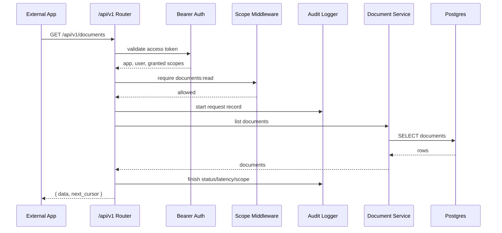
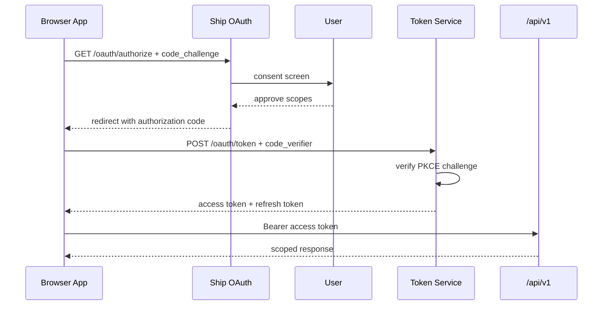
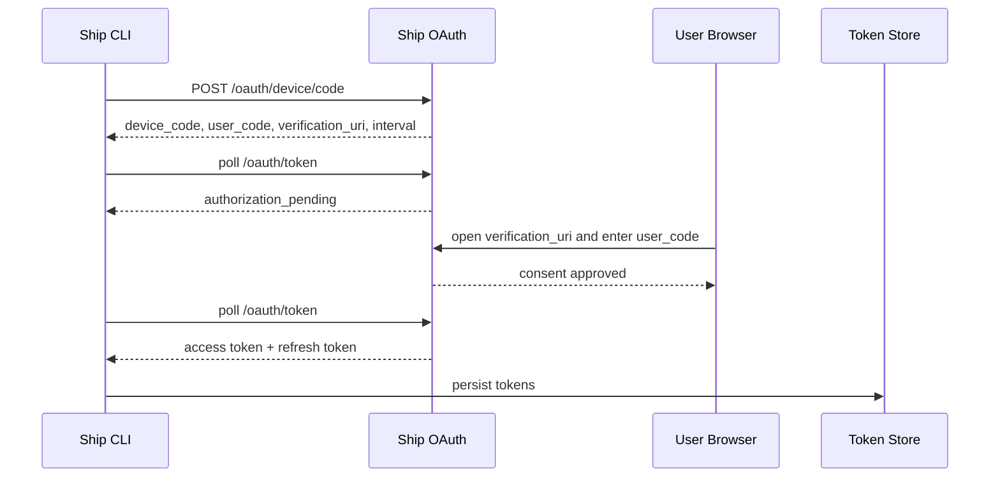
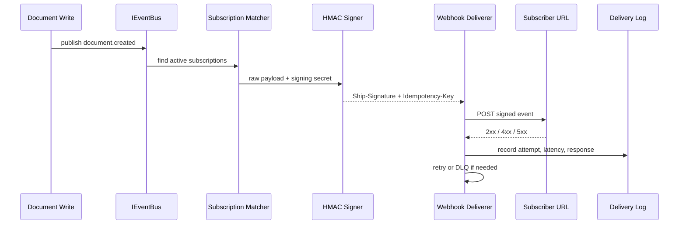
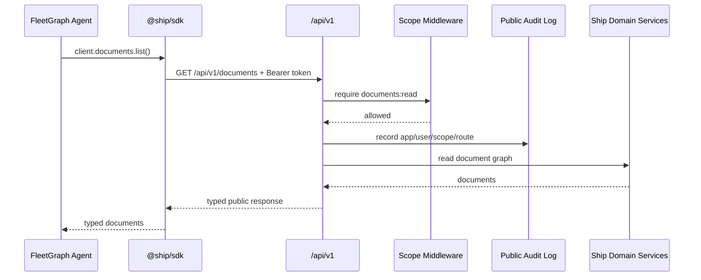

# Plugforge Architecture

Plugforge turns Ship into a developer platform. The platform contract is deliberately small: a versioned `/api/v1` public API, OAuth apps and tokens, scopes-as-data, generated OpenAPI, a typed SDK, signed webhooks, and a CLI reference integration. Internal Ship routes remain under `/api/*`; public consumers use `/api/v1/*`.

## Architectural Defense Coverage

| PRD-required section | Covered here |
|---|---|
| Module Layout | Module Layout |
| SOLID Rationale | SOLID Rationale |
| Composition Root | Composition Root |
| Public/Internal Boundary | Public/Internal Boundary |
| OAuth Flows | OAuth Flows |
| Webhook Pipeline | Webhook Pipeline |
| SDK Surface | SDK Surface |
| Agent-as-Citizen | Agent As Citizen |
| Failure Modes | Failure Modes |
| Scope and risk discipline | MVP Cut, Risk Register, Architectural Decisions To Defend |

## MVP Cut

Tuesday MVP is intentionally narrower than the final platform. The MVP must prove the contract spine:

- OAuth app registration with hashed `client_secret` and raw secret shown once.
- Authorization Code + PKCE happy path and wrong-verifier negative path.
- Bearer token middleware on `/api/v1/*`.
- Scope registry and `requireScope(scope)` middleware.
- Public documents API: list, get by id, and create.
- Consistent `ApiError` shape with `request_id`.
- Generated `/api/v1/openapi.json`.
- SDK skeleton where `new ShipClient({ token }).me()` works against a running server.
- Device Authorization Grant for CLI-style integrations, including `authorization_pending`
  and `slow_down` branches.

Post-MVP scope adds webhooks, CLI, TTFE drill, developer portal, rate-limit hardening, and FleetGraph's agent-as-citizen rewire. The defense is that OAuth + public API correctness is the foundation; webhooks and CLI become meaningful only after tokens, scopes, errors, and OpenAPI are stable.

## Build Strategy Priority Order

The platform was built contract-first. Each step either establishes the next
step's boundary or creates the fitness test that catches drift.

| Priority | Build slice | Why this order | Evidence |
|---:|---|---|---|
| 1 | OAuth foundation first: app registration, Authorization Code + PKCE, wrong-verifier rejection, Device Authorization Grant, refresh rotation. | Without working tokens and scope checks, every later API, SDK, webhook, and CLI surface lacks a contract. | `api/src/platform/routes/oauth.ts`, `api/src/platform/platform.test.ts`, `e2e/plugforge-oauth.spec.ts`, `sdk/src/auth.ts`. |
| 2 | Public/internal API boundary on Day 1 with a fresh `/api/v1` router and boundary lint/fitness before broad route growth. | Boundary enforcement is cheap before cross-imports exist and expensive once public routes depend on internal handlers. | `api/src/platform/api-v1.ts`, `api/src/platform/fitness.test.ts`. |
| 3 | `ApiError` and public error middleware before resource endpoints. | A consistent failure shape is part of the API contract, not cleanup after resources exist. | `api/src/platform/errors.ts`, route failure assertions in `api/src/platform/fitness.test.ts`. |
| 4 | OpenAPI generated from route metadata before expanding resources. | One resource plus generated spec proves the metadata loop; spec-route-SDK parity then defends every addition. | `api/src/platform/openapi.ts`, `api/src/platform/export-openapi.ts`, `docs/openapi.json`. |
| 5 | Webhooks end-to-end: registry, bus, subscriptions, signer, deliverer, delivery log, replay. | The slices are small but only meaningful as a full loop from domain write to signed subscriber delivery and observable replay. | `api/src/platform/events.ts`, `api/src/platform/domain/documents.ts`, `api/src/platform/webhooks.ts`, `api/src/platform/routes/webhooks.ts`. |
| 6 | SDK skeleton, one resource client, and auth helpers. | The SDK should be exercised by real consumers as it is built; CLI and drills reveal ergonomic bugs faster than isolated unit tests. | `sdk/src/client.ts`, `sdk/src/documents.ts`, `sdk/src/auth.ts`, `sdk/src/webhook-client.ts`. |
| 7 | CLI reference integration. | The CLI is the proof that a developer can compose the platform without first-party UI privileges. | `integrations/cli/src/index.mjs`, `integrations/cli/tests/ttfe.drill.ts`. |
| 8 | Developer Portal and Epic 7 agent rewire. | The portal is a short should-ship consumer of the public surface; the agent rewire is the architectural payoff and belongs behind a feature flag so Part 2 behavior can be preserved. | `web/src/pages/DeveloperPortal.tsx`, `docs/architecture.md#agent-as-citizen`, `PLUGFORGE_AI_COST_ANALYSIS.md`. |

## Technical Stack

The stack follows the pre-search constraint: use whatever helps Ship ship, but
make the public contract explicit, typed, and testable.

| Layer | Chosen technology | Alternatives considered | Decision rationale |
|---|---|---|---|
| Backend | Existing Ship stack: Node.js, Express, TypeScript. TypeScript strict mode is required for platform/SDK surfaces. Zod supplies request/response schemas and OpenAPI metadata. | Fastify, NestJS, a separate platform service. | Reusing Express avoids framework churn and keeps the public API close to the existing document model while route metadata and tests supply the contract discipline. |
| Frontend Developer Portal | Existing Ship React UI. Portal screens reuse public-platform endpoints where reasonable and show the same app/subscription/delivery surfaces external developers use. | Separate docs portal, admin-only internal API only. | Dogfooding the public API keeps the portal honest and avoids a private management path that contradicts the platform story. |
| AI / LLM | Agent service only. Claude API is the primary Part 2 path; Sonnet 4-class models are recommended for reasoning. GPT-4-class OpenAI models or local Llama via Ollama are acceptable agent alternatives. | Platform-side AI enrichment on writes or webhooks. | Plugforge itself is LLM-free. LLM cost and provider choice stay isolated to explicit FleetGraph agent turns. |
| OAuth implementation | Hand-rolled minimal IETF-correct flows: RFC 6749 Authorization Code, RFC 7636 PKCE, RFC 8628 Device Authorization Grant, plus refresh rotation. | `node-oauth2-server`, Ory Hydra, Auth0 fronting Ship. | Hand-rolling the small required subset is the learning goal and keeps the demo understandable; tests cover verifier mismatch, slow-down, rotation, and family invalidation. |
| Webhook queue | In-memory must-ship deliverer with persisted event/delivery rows. | BullMQ + Redis, Inngest, AWS SQS. | In-memory is enough for deterministic MVP signing/retry/DLQ/replay proof. The persisted state and interfaces leave room for a queue-backed drop-in. |
| Rate limiting | In-memory token-bucket by app and access token. | `@upstash/ratelimit`, Redis-backed buckets, Cloudflare edge rate-limit rules. | In-memory proves headers and isolation with low operational risk. Production should move the bucket to shared storage or edge rules. |
| OpenAPI / SDK | Zod schemas to OpenAPI 3.1 through `@asteasolutions/zod-to-openapi`; SDK is hand-written TypeScript and fitness-tested against the spec. | Fully generated SDK, hand-written OpenAPI. | Generated specs prevent handler/spec drift; a hand-written SDK gives better DX while parity tests prevent missing methods. |
| Reference integrations | CLI in Node; Slack adapter as Express-compatible webhook/OAuth pattern; GitHub adapter via GitHub App webhook pattern, compatible with `@octokit/auth-app` for production. | Heavy CLI frameworks such as commander or oclif; fully deployed Slack/GitHub apps in MVP. | The reference integrations prove the flows without adding unnecessary package weight. Production integrations can adopt the framework/client libraries. |
| Architecture patterns | SOLID through TypeScript interfaces, one composition root, public/internal API boundary tests, and in-memory test doubles. | Route-level ad hoc wiring, direct imports from internal handlers. | Interfaces and boundary tests let the MVP stay small without losing substitutability for queues, stores, and test doubles. |
| Deployment | Reuse Ship deployment. Fly.io, Railway, Render, and AWS are all acceptable hosts; the current Ship branch documents AWS/free-tier deployment paths. `@ship/sdk` is a workspace package with npm-publish steps documented. | Separate platform-only deployment. | Reusing Ship keeps the grader surface simple: app, Developer Portal, OpenAPI URL, and one SDK package. |

## Module Layout

Planned backend layout:

```text
api/src/platform/
  api-v1/          Public Express routers, route metadata, pagination helpers
  apps/            OAuth app registration, secret hashing, rotation
  audit/           Public API audit logging
  errors/          ApiError class, request_id middleware, public error handler
  oauth/           Authorization Code + PKCE, Device Grant, token rotation
  openapi/         Zod route metadata to OpenAPI 3.1 generator
  ratelimit/       Per-app and per-token token buckets
  scopes/          ScopeRegistry and requireScope middleware
  webhooks/        Event registry, signer, subscriptions, deliverer, DLQ, replay
```

Planned SDK/integration layout:

```text
sdk/
  src/
    client.ts          ShipClient root
    documents.ts       DocumentsClient
    issues.ts          IssuesClient placeholder for parity
    sprints.ts         SprintsClient placeholder for parity
    webhooks.ts        WebhooksClient and verifyWebhook
    auth/              deviceLogin, authorizationCodeFlow, token stores
    errors.ts          typed SDK error union

integrations/
  cli/
    src/               ship login, docs, webhooks subscribe
    tests/             TTFE drill and CLI integration tests
```

Database changes live in numbered migrations under `api/src/db/migrations/`. Ship's existing `documents` table remains the source of truth for documents, issues, sprints, projects, programs, and people.

## SOLID Rationale

**Single Responsibility.** Public platform modules have one job each. `errors` owns the response shape, `scopes` owns authorization decisions, `oauth` owns token lifecycle, and `webhooks` owns delivery. This prevents `/api/v1` handlers from becoming large mixed-responsibility functions.

**Open/Closed.** `ScopeRegistry` and `EventRegistry` are data registries. Adding `issues:read` or `issue.assigned` should register new data without rewriting middleware. The OpenAPI generator also stays closed to route-specific behavior by reading metadata instead of special-casing endpoints.

**Liskov Substitution.** `IEventBus` and `IWebhookDeliverer` define contracts that can be backed by in-memory implementations for MVP and queue-backed implementations later. Tests use the same interface as production code.

**Interface Segregation.** The SDK exposes focused resource clients for the MVP contract: `client.documents` and `client.webhooks`, plus small top-level helpers for app context and discovery. Consumers do not import one giant client with every method mixed together, and future issue/sprint clients can be added without changing the documents or webhooks surface.

**Dependency Inversion.** Public routes depend on domain/data services and platform interfaces, not on internal Express route handlers. Webhook publishing depends on `IEventBus`, not on a concrete queue. The SDK and CLI talk only to `/api/v1` and `/oauth`; neither imports `api/src`.

## Composition Root

Production wiring belongs in `api/src/app.ts` or a small sibling composition module:

```ts
const scopeRegistry = createScopeRegistry();
const oauthStore = new PostgresOAuthStore(pool);
const tokenService = new OAuthTokenService(oauthStore, clock, crypto);
const rateLimiter = new InMemoryTokenBucket();
const auditLogger = new PostgresAuditLogger(pool);
const eventBus = new InProcessEventBus();
const webhookDeliverer = new InProcessWebhookDeliverer(pool, clock, fetch);

const publicApi = createPublicApiRouter({
  tokenService,
  scopeRegistry,
  rateLimiter,
  auditLogger,
  eventBus,
});

app.use("/api/v1", publicApi);
app.use("/oauth", createOAuthRouter({ tokenService, scopeRegistry }));
```

Test wiring swaps concrete implementations:

```ts
const clock = new FakeClock();
const eventBus = new InMemoryEventBus();
const webhookDeliverer = new CapturingWebhookDeliverer(clock);
```

This keeps retry tests deterministic and avoids real-time sleeps.

## Public/Internal Boundary

Public routes live only under `/api/v1/*`. Internal Ship routes remain under `/api/*`. Public routes may call shared domain/data services, but they must not import internal route handlers.

```text
external app
  -> /api/v1/documents
  -> request_id
  -> rate limit headers
  -> bearer token auth
  -> requireScope("documents:read")
  -> audit start
  -> document service / direct pg utility
  -> audit finish
  -> ApiError or typed response

Ship UI
  -> /api/documents
  -> session auth
  -> existing internal route
  -> same document service / direct pg utility
```

This preserves Ship's existing UI while giving external developers a stable, versioned contract.



## OAuth Flows

### Authorization Code + PKCE

```text
browser app -> GET /oauth/authorize?client_id&redirect_uri&scope&code_challenge
Ship session auth -> consent screen
user approves -> auth code stored with code_challenge and scopes
redirect -> client callback with code
client -> POST /oauth/token with code_verifier
token service verifies PKCE challenge
token service issues access token + refresh token
client -> /api/v1/* with Bearer access token
```

Wrong or missing `code_verifier` returns `400 invalid_grant`. Auth codes are single-use and short-lived.



### Device Authorization Grant

```text
CLI -> POST /oauth/device/code
server returns device_code, user_code, verification_uri, interval
CLI polls /oauth/token
user visits verification_uri and approves user_code
poll returns access token + refresh token
CLI stores tokens in file token store
```

Polling faster than the issued interval returns `slow_down`. Expired or denied device codes return explicit OAuth errors.



### Refresh Token Rotation

```text
client -> /oauth/token grant_type=refresh_token
token service checks token family and spent status
old refresh token marked spent
new access token and refresh token issued
reuse of spent token invalidates the family and revokes active access tokens
```

This detects stolen refresh token replay and shuts down the token family instead
of leaving already-issued access tokens alive.

## Webhook Pipeline

```text
document write
  -> domain publishes document.created
  -> IEventBus
  -> subscription matcher
  -> payload builder
  -> signer creates Ship-Signature
  -> IWebhookDeliverer
  -> POST target URL
  -> webhook_deliveries row
  -> retry scheduler or DLQ
  -> replay endpoint can re-emit original event
```

The signature is HMAC-SHA256 over `timestamp + "." + rawBody`. The SDK verifier rejects missing `v1`, tampered bodies, and timestamps older than 5 minutes by default. Replays preserve the original idempotency key.



## SDK Surface

Stable MVP surface:

```ts
const client = new ShipClient({ token });

await client.me();
await client.documents.list();
await client.documents.get(id);
await client.documents.create({ title: "hello" });

for await (const doc of client.documents.iterate()) {
  // cursor handled internally
}

const subscription = await client.webhooks.createSubscription({
  event_type: "document.created",
  target_url: "https://example.com/ship/webhook",
});

verifyWebhook(headers, rawBody, signingSecret);
```

Auth helpers:

```ts
await ShipClient.deviceLogin({
  clientId: "ship_app_...",
  scope: "documents:read documents:write",
  onCode: ({ user_code, verification_uri }) => {
    console.log(`Open ${verification_uri} and enter ${user_code}`);
  },
});

await ShipClient.refreshAccessToken({
  clientId: "ship_app_...",
  refreshToken,
});
```

Pre-1.0 surfaces:

- `client.issues`
- `client.sprints`
- advanced webhook filters
- browser localStorage token store

## CLI Reference Integration

The reference CLI lives at `integrations/cli` and is intentionally dependency-light. It proves the developer path without requiring the Ship web UI:

```bash
node integrations/cli/src/index.mjs login --client-id ship_app_... --ship-url http://localhost:3000
node integrations/cli/src/index.mjs scopes --ship-url http://localhost:3000
node integrations/cli/src/index.mjs docs ls --limit 10 --type wiki --ship-url http://localhost:3000
node integrations/cli/src/index.mjs docs get <document-id> --ship-url http://localhost:3000
node integrations/cli/src/index.mjs docs create "CLI proof" --ship-url http://localhost:3000
node integrations/cli/src/index.mjs webhooks events --ship-url http://localhost:3000
node integrations/cli/src/index.mjs webhooks subscribe --url https://example.com/ship/webhook --ship-url http://localhost:3000
node integrations/cli/src/index.mjs webhooks rotate-secret <subscription-id> --ship-url http://localhost:3000
node integrations/cli/src/index.mjs webhooks deactivate <subscription-id> --ship-url http://localhost:3000
node integrations/cli/src/index.mjs webhooks tail --ship-url http://localhost:3000
```

`SHIP_TOKEN` can override the local token store for repeatable demos. By default,
successful device login stores the `client_id`, access token, and rotating
refresh token in `~/.ship/plugforge-cli.json`. When a CLI API call receives
`token_expired`, it refreshes once, persists the new token pair, and retries the
request.
The CLI opens the browser-facing `/oauth/device/verify` approval flow, which is
session-authenticated and supports prefilled `user_code` query parameters. OAuth
pages and token endpoints set `Cache-Control: no-store`, `X-Frame-Options: DENY`,
and `frame-ancestors 'none'`.

## TTFE Drill

The time-to-first-event drill proves the platform from a developer's point of
view: create a webhook subscription, create a document, receive a signed
`document.created` event, and confirm the delivery log.

```bash
SHIP_URL=http://localhost:3000 SHIP_TOKEN=ship_at_... node scripts/plugforge-ttfe-drill.mjs
```

The token must include `documents:write` and `webhooks:manage`. The script prints
a JSON result with elapsed time, document id, subscription id, delivery id,
delivery status, response status, and signature verification. It deactivates the
temporary subscription by default so repeated drills do not accumulate live
webhook endpoints; `KEEP_WEBHOOK=1` preserves the subscription for manual
inspection.

## Developer Portal

The Developer Portal lives at `/settings/developers` for workspace admins. It
can create OAuth apps, show the raw `client_secret` once, list registered apps
without returning `client_secret` or `client_secret_hash`, link to
`/api/v1/openapi.json`, and display CLI commands for login, document creation,
subscription creation, and webhook tailing.
Workspace admins can rotate an app secret; the old secret stops working
immediately and the new raw secret is returned once.
Workspace admins can also deactivate an app as an emergency stop. Inactive apps
cannot start OAuth flows, and existing bearer tokens for inactive apps are
rejected by public API auth.

## Audit Evidence

Every `/api/v1/*` response records a `public_api_audit_log` row with
`request_id`, OAuth app identity, user/workspace identity, method, route,
scope used, status, and latency. The Plugforge fitness suite asserts a
`GET /api/v1/documents` call records `client_id`, `documents:read`, route, and
status.

## Agent As Citizen

Before:

```text
FleetGraph agent -> internal Ship API / direct service account path -> documents
```

After:

```text
FleetGraph OAuth app -> @ship/sdk -> /api/v1 -> scope middleware -> audit log -> documents
```

The payoff is that the agent has the same scopes, rate limits, and audit trail as an external developer app. The final proof should be an audit-log row showing FleetGraph's app identity, route, scope, status, and latency.

The cost payoff is deliberately boring: this rewire changes the agent's access
shape, not the platform's cost shape. Plugforge platform traffic does zero AI
work. LLM calls remain isolated to FleetGraph agent turns, so the AI bill scales
with agent activity rather than OAuth traffic, API reads, document writes, or
webhook delivery volume.



## Failure Modes

**Token store corrupted.** SDK treats unreadable token stores as logged-out state and asks the user to login again. It must not silently reuse partial tokens.

**Subscriber signing secret rotated mid-flight.** New deliveries use the new secret. Old delivery rows record which subscription and attempt were used. MVP does not support dual-secret grace periods, so a subscriber must update its secret before expecting future signatures to verify. A public app with `webhooks:manage` can also deactivate a subscription as an emergency stop; deactivation stops future fan-out without deleting historical delivery evidence.

**Queue deliverer crashes.** MVP in-memory delivery is process-local and therefore not durable across crash. Every delivery attempt is persisted with status, response, latency, and next retry time, so the retry scanner can resume visible failures after the process is healthy. Subscribers must treat delivery as at-least-once and dedupe by idempotency key.

**Webhook retries.** Transient failures (`5xx`, `429`, or network errors) become `retry_pending` with the schedule `1s, 4s, 16s, 1m, 5m, 30m`. A subscriber `429` can override the next retry with `Retry-After`, capped at the maximum backoff. Permanent `4xx` failures go straight to `dead_letter`. After six attempts, transient failures also move to `dead_letter`. Replay preserves the original event idempotency key.
The API process starts an in-process retry worker every 15 seconds for MVP; the
Postgres delivery state means this can move to a separate queue worker later.

**OpenAPI generator throws at boot.** Fail fast in non-production/test. In production, serve the last generated static `docs/openapi.json` only if available and log an error; do not silently serve a partial spec.

**OAuth app owner deleted.** Deactivate the app and require admin transfer before reactivation. This is safer than leaving orphaned credentials active.

**Rate limiter misconfigured.** Public API should default closed: conservative per-token limits and explicit headers on every response. Missing limiter config should not mean unlimited traffic.

**Demo rate limit.** MVP uses an in-memory one-minute bucket with `RateLimit-Limit`,
`RateLimit-Remaining`, and `RateLimit-Reset` headers on `/api/v1/*`. Bearer-token
requests are keyed by a hash of the presented token before auth validation, so two
apps behind the same NAT do not exhaust one shared IP bucket. Requests without a
bearer token fall back to IP. Production should swap this for Redis or another
shared store so limits hold across instances.

## Risk Register

| Risk | Impact | Mitigation |
|---|---|---|
| OAuth correctness slips | MVP blocker and security risk | Implement PKCE first, include Playwright happy path and wrong-verifier `invalid_grant` test |
| Public/internal route leakage | Contract becomes unstable | Add boundary test/lint rule banning imports from internal route handlers into `api/src/platform/api-v1` |
| OpenAPI drift | SDK and docs lie | Generate spec from route metadata and add route/spec/SDK parity fitness tests |
| Webhook retry tests become flaky | CI instability | Inject fake clock/scheduler; avoid real sleeps in retry tests |
| TTFE drill fails late | Final rubric risk | Add first TTFE drill as soon as SDK + documents + webhooks work, then keep it in CI |
| SDK grows heavy | Fails install-size target | Keep `@ship/sdk` dependency-light; put CLI dependencies in `integrations/cli` |
| Agent rewire breaks Week 5 behavior | Regression risk | Feature flag public-API mode and run tests with flag on/off |

## Implementation Order

1. Errors, request IDs, and `/api/v1` router skeleton.
2. Scope registry and bearer token middleware.
3. OAuth app model and registration.
4. Authorization Code + PKCE.
5. `/api/v1/me` and documents list/get/create.
6. OpenAPI generation and fitness tests.
7. SDK `ShipClient`, documents client, errors, and pagination.
8. Device Grant and CLI login.
9. Webhook event registry, signer, deliveries, replay.
10. TTFE drill and developer portal.
11. FleetGraph agent-as-citizen rewire.

## Fitness Checks

Plugforge has a focused API fitness suite:

```bash
corepack.cmd pnpm --filter @ship/api plugforge:fitness
corepack.cmd pnpm --filter @ship/api plugforge:openapi
```

It verifies the public platform boundary does not import internal `api/src/routes`
handlers, and it checks OpenAPI paths for documents/webhooks against SDK client
methods. This is intentionally small and fast so it can run before every demo
without replacing the broader build/test suite. The OpenAPI export command writes
the static public contract to `docs/openapi.json`.

## Architectural Decisions To Defend

**Small API first.** Documents are the first public resource because every Ship content type uses the unified document model. This gets the contract right before expanding to issues and sprints.

**Generated OpenAPI.** Route metadata and Zod schemas are the source of truth. Hand-written specs drift.

**Public/internal split.** `/api/v1` is not a thin alias of internal routes. It is a contract boundary with OAuth, scopes, rate limits, audit, pagination, and stable errors.

**In-memory webhooks first.** In-memory delivery is enough for demo and test determinism. Interfaces are shaped so Redis/SQS can replace it later.

**SDK hand-written, parity-tested.** Generated SDKs often expose awkward types. A hand-written SDK gives good DX, while parity tests prevent missing methods.

## Defense Talking Points

**Why separate `/api/v1` from internal `/api`?** Internal routes are optimized for Ship's first-party UI and session model. Public routes need OAuth, scopes, rate-limit headers, cursor pagination, stable errors, OpenAPI metadata, and audit logging. Mixing them would make the public contract inherit internal UI churn.

**Why Authorization Code + PKCE for web apps and Device Grant for CLI?** Browser/web integrations can redirect through a consent screen and use PKCE to bind the code to the original client. CLIs cannot safely host a browser redirect or keep a client secret, so Device Grant gives a user-code approval flow designed for terminals.

**Why generated OpenAPI?** The spec is the platform contract. A hand-written spec will drift from handlers. Route metadata plus Zod schemas lets the server, docs, tests, and SDK parity checks all read from the same source of truth.

**Why in-memory webhooks for MVP?** The PRD allows an in-process must-ship implementation. The interface shape (`IEventBus`, `IWebhookDeliverer`) lets us prove signing, logging, retry, DLQ, and replay without adding Redis/SQS operational risk during the learning sprint.

**Why make FleetGraph an OAuth app?** It proves Ship is actually a platform. The agent should not have a privileged shortcut that external developers cannot use. Going through OAuth + SDK gives scopes, rate limits, and audit rows for the agent just like any other integration.
