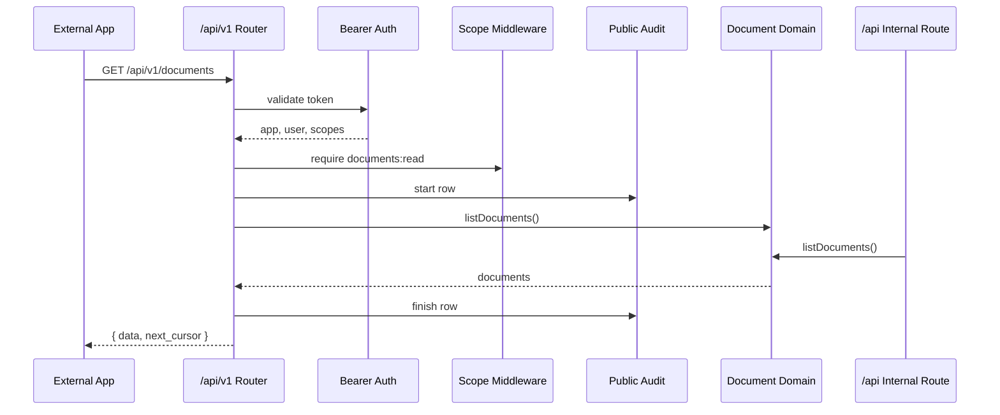
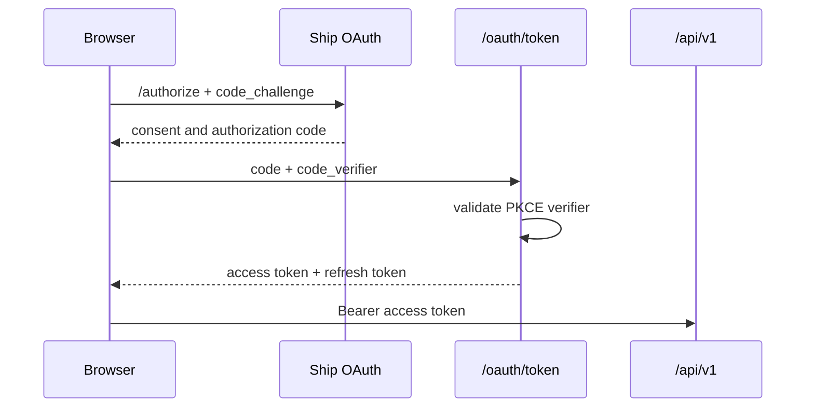
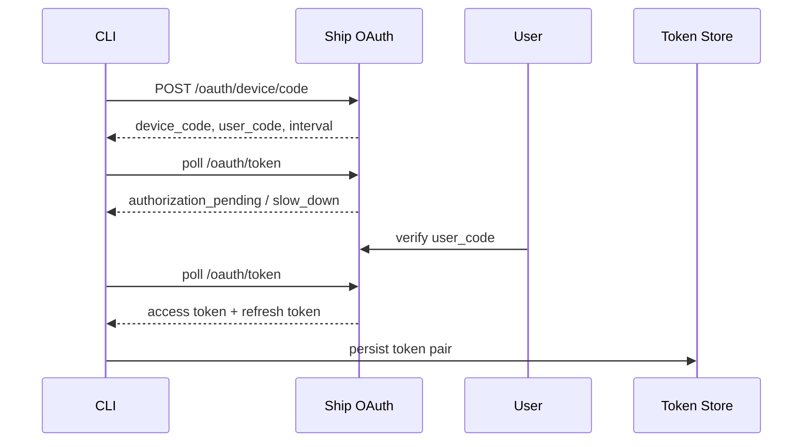

# Plugforge Architecture

Plugforge turns Ship into a small developer platform: OAuth apps, `/api/v1`,
generated OpenAPI, a typed SDK, signed webhooks, a CLI, and a Developer Portal.
Detailed rationale lives in `docs/architecture-extended.md`; this file is the
required concise architecture document.

## Module Layout

```text
api/src/platform/
  api-v1.ts          Public Express router; mounts only `/api/v1/*` contract routes.
  routes/apps.ts     OAuth app registration, one-time secret display, rotation, app audit views.
  routes/oauth.ts    RFC 6749 auth-code, RFC 7636 PKCE, RFC 8628 device grant, refresh rotation.
  routes/documents.ts Public documents list/get/create resource routes.
  routes/issues.ts   Issue facade over the unified document model.
  routes/sprints.ts  Sprint facade over the unified document model.
  routes/webhooks.ts Webhook subscription, delivery-log, and replay routes.
  auth.ts            Bearer token validation and request context population.
  scopes.ts          ScopeRegistry and `requireScope(scope)` middleware.
  ratelimit.ts       Per-app and per-token in-memory token buckets.
  webhooks.ts        Event persistence, signing, delivery attempts, retry scan, DLQ.
  events.ts          Event registry, `IEventBus`, in-process and queue-backed bus contracts.
  openapi.ts         Route metadata to OpenAPI 3.1 generator.
  audit.ts           Public API audit-log writer.
  errors.ts          `ApiError` and public error response shape.

sdk/src/
  client.ts          `ShipClient` root plus `me`, scopes, auth helper statics.
  documents.ts       Documents resource client with list/get/create/iterate.
  document-resources.ts Issue and sprint resource-segregated clients.
  webhook-client.ts  Webhook resource client.
  webhooks.ts        `verifyWebhook(headers, rawBody, secret)`.
  auth.ts            PKCE, device login, and refresh-token helper functions.
  token-store.ts     Memory, file, and browser localStorage token stores.
  errors.ts          `ShipSDKError` and discriminated error union.
  types.ts           Public SDK and API types.
```

## SOLID Rationale

**SRP.** Platform modules own one concern each: `api/src/platform/errors.ts`
owns public failures, `scopes.ts` owns authorization decisions, `ratelimit.ts`
owns buckets, `webhooks.ts` owns delivery state, and `openapi.ts` owns spec
generation.

**OCP.** `api/src/platform/scopes.ts` and `api/src/platform/events.ts` register
scopes/events as data. Adding `issues:read` or `issue.assigned` extends registry
data without rewriting middleware.

**LSP.** `IEventBus` in `api/src/platform/events.ts` supports
`InProcessEventBus` for MVP and `QueueBackedEventBus` as a substitutable
production adapter.

**ISP.** SDK consumers use focused clients: `client.documents` in
`sdk/src/documents.ts`, `client.issues`/`client.sprints` in
`sdk/src/document-resources.ts`, and `client.webhooks` in
`sdk/src/webhook-client.ts`.

**DIP.** Public routes depend on platform/domain interfaces, not internal Express
handlers. `api/src/platform/domain/documents.ts` publishes through `IEventBus`;
`scripts/plugforge-boundary-check.mjs` enforces that `/api/v1` and
`integrations/` do not import private API handlers.

## Composition Root

```ts
// api/src/app.ts, production wiring
const scopeRegistry = createScopeRegistry();
const rateLimiter = createInMemoryTokenBucket();
const eventBus = new InProcessEventBus();
eventBus.subscribe('document.created', ({ event }) =>
  publishWebhookEvent({ ...event, workspaceId: event.workspaceId })
);

app.use('/oauth', createOAuthRouter({ pool, crypto, clock }));
app.use('/api/v1', createPublicApiRouter({
  auth: bearerAuth({ pool }),
  scopeRegistry,
  rateLimiter,
  audit: publicApiAuditLogger({ pool }),
  eventBus,
  webhookDeliverer: deliverWebhook,
}));

// Test wiring
const testEventBus = new InProcessEventBus();
const fakeDeliverer = new CapturingWebhookDeliverer({ clock: fakeClock });
const testApi = createPublicApiRouter({ eventBus: testEventBus, webhookDeliverer: fakeDeliverer });
```

## Public/Internal Boundary



Public routes attach OAuth, scopes, rate-limit headers, audit, and public
`ApiError`; internal routes keep session-auth UI behavior while sharing domain
services.

## OAuth Flows



Refresh-token rotation happens on `/oauth/token` with
`grant_type=refresh_token`: the old token is marked spent, a new refresh token is
issued, and reuse invalidates the family.



## Webhook Pipeline

```text
document write
  -> domain creates idempotency key (`document.created:<id>`)
  -> IEventBus
  -> subscription matcher
  -> signer computes HMAC over `timestamp.rawBody`
  -> IWebhookDeliverer
  -> retry scheduler
  -> webhook_deliveries log
  -> replay preserves original Idempotency-Key
```

The signature is emitted as
`Ship-Signature: t=<unix-seconds>,v1=<hex-hmac-sha256>`. The SDK rejects
tampered bodies, missing `v1`, and timestamps older than five minutes.

## SDK Surface

Stable: `new ShipClient({ token }).me()`, `client.documents.list/get/create`,
`client.documents.iterate()`, `ShipClient.authorizationCodeFlow()`,
`ShipClient.deviceLogin()`, `ShipClient.refreshAccessToken()`, token stores,
`verifyWebhook()`, and `ShipSDKErrorUnion`.

Pre-1.0 but implemented: `client.issues`, `client.sprints`,
`client.webhooks`, OAuth app admin helpers, delivery replay helpers, and browser
localStorage token store.

## Agent As Citizen

```text
Before: FleetGraph agent -> internal Ship service/API shortcut -> documents
After:  FleetGraph OAuth app -> @ship/sdk -> /api/v1 -> domain services
```

The payoff is auditability: the agent receives the same scopes, rate limits,
OpenAPI contract, and public API audit rows as any external OAuth app. The
platform remains LLM-free; model calls are isolated to explicit agent turns.

## Failure Modes

**Token store corrupted.** SDK stores fail closed: unreadable or missing tokens
mean logged-out state, not partial token reuse. The user must run device login or
provide a new token.

**Signing secret rotated mid-flight.** Future deliveries use the new
subscription secret immediately. Historical deliveries remain tied to their
delivery rows; subscribers must update their stored secret before verifying new
payloads.

**Queue deliverer crashes.** MVP in-memory delivery is process-local, but events
and attempts are persisted. Pending or failed attempts are visible in the
delivery log and can be retried/replayed. A queue-backed deliverer can replace
the in-memory implementation behind `IWebhookDeliverer`.

**OpenAPI generator throws at boot.** Non-production/test should fail fast. In
production, serve the last generated static `docs/openapi.json` only if present,
log the generator failure, and never serve a partial spec silently.
